# Architecture

## Module layout

```mermaid
flowchart TD
    App["computer-automation executable"]
    Foundation["AutomationFoundation shared module"]
    Zsh["zsh completion script"]
    ZshInstaller["zsh completion installer"]
    Safari["Safari module"]
    SafariUI["SafariUserInterface module"]
    SafariScript["SafariAppleScript module"]
    SafariDB["SafariDatabase module"]
    SafariApplication["SafariApplication model"]
    SafariProfile["SafariProfile model"]
    SafariWindow["SafariWindow model"]
    SafariTabGroup["SafariTabGroup model"]
    SafariTab["SafariTab model"]
    DBProfile["SafariDatabaseProfile model"]
    DBWindow["SafariDatabaseWindow model"]
    DBTabGroup["SafariDatabaseTabGroup model"]
    ScriptApplication["script application model"]
    ScriptWindow["script window model"]
    ScriptTab["script tab model"]
    ScriptMenuBar["script menu bar model"]
    ScriptMenu["script menu model"]
    ScriptMenuItem["script menu item model"]
    SafariMenuBar["application-menu-bar model"]
    SafariMenu["menu model"]
    SafariFileMenu["file-menu model"]
    SafariMenuItem["menu-item model"]
    MenuBarItems["menu-bar-items command"]
    MenuItems["menu-items command"]
    FileMenuItems["file-menu-items command"]
    MenuItemChildren["menu-item-children command"]
    Launch["launch command"]
    Running["running command"]
    Quit["quit command"]
    Profiles["profiles command"]
    ProfileFind["find-profile command"]
    ProfileResolve["resolve-profile command"]
    WindowOpen["open-window command"]
    WindowOpenPrivate["open-private-window command"]
    Windows["windows command"]
    WindowClose["close-window command"]
    TabGroupEnsure["ensure-tab-group command"]
    TabGroups["tab-groups command"]
    TabGroupFind["find-tab-group command"]
    TabGroupResolve["resolve-tab-group command"]
    TabGroupTabs["tab-group-tabs command"]
    TabOpen["open-tab command"]
    Tabs["tabs command"]
    TabFind["find-tab command"]
    TabResolve["resolve-tab command"]
    WindowTabs["window-tabs command"]
    TabExecuteJavaScript["execute-tab-javascript command"]
    TabSetURL["set-tab-url command"]
    TabClose["close-tab command"]

    App --> Foundation
    Zsh --> App
    ZshInstaller --> App
    App --> Safari
    App --> SafariUI
    App --> SafariScript
    Safari --> Foundation
    Safari --> SafariScript
    Safari --> SafariDB
    Safari --> SafariUI
    SafariDB --> Foundation
    SafariUI --> Foundation
    SafariUI --> SafariScript
    SafariScript --> Foundation
    Safari --> SafariApplication
    Safari --> SafariProfile
    Safari --> SafariWindow
    Safari --> SafariTabGroup
    Safari --> SafariTab
    SafariDB --> DBProfile
    SafariDB --> DBWindow
    SafariDB --> DBTabGroup
    SafariScript --> ScriptApplication
    SafariScript --> ScriptWindow
    SafariScript --> ScriptTab
    SafariScript --> ScriptMenuBar
    SafariScript --> ScriptMenu
    SafariScript --> ScriptMenuItem
    SafariUI --> SafariMenuBar
    SafariUI --> SafariMenu
    SafariUI --> SafariFileMenu
    SafariUI --> SafariMenuItem
    SafariMenuBar --> MenuBarItems
    SafariMenu --> MenuItems
    SafariFileMenu --> FileMenuItems
    SafariMenuItem --> MenuItemChildren
    SafariMenu --> SafariMenuItem
    SafariFileMenu --> SafariMenu
    SafariApplication --> Launch
    SafariApplication --> Running
    SafariApplication --> Quit
    SafariProfile --> Profiles
    SafariProfile --> ProfileFind
    SafariProfile --> ProfileResolve
    SafariProfile --> DBProfile
    SafariWindow --> WindowOpen
    SafariWindow --> WindowOpenPrivate
    SafariWindow --> Windows
    SafariWindow --> WindowClose
    SafariWindow --> DBWindow
    SafariTabGroup --> TabGroupEnsure
    SafariTabGroup --> TabGroups
    SafariTabGroup --> TabGroupFind
    SafariTabGroup --> TabGroupResolve
    SafariTabGroup --> TabGroupTabs
    SafariTabGroup --> DBTabGroup
    SafariTab --> TabOpen
    SafariTab --> Tabs
    SafariTab --> TabFind
    SafariTab --> TabResolve
    SafariTab --> WindowTabs
    SafariTab --> TabExecuteJavaScript
    SafariTab --> TabSetURL
    SafariTab --> TabClose
    WindowOpen --> SafariFileMenu
    WindowOpenPrivate --> SafariFileMenu
    SafariTab --> ScriptTab
```

## Notes

- The first architectural level is the module.
- Modules typically represent an application or a service boundary.
- Models represent distinct parts of a module's domain.
- Prefer general structural UI models before adding specialized models for concrete application areas.
- Keep related operations on one feature aligned to one primary automation surface whenever the product allows it.
- `AutomationFoundation` owns shared command metadata, dispatch output formats, JSON output helpers, completion, and shell completion installation.
- Apply YAGNI before expanding the model graph: add a new model only when current behavior needs that surface, not for speculative symmetry.
- When a feature relies on a Safari accessibility structure, represent that structure as a reusable `SafariUserInterface` model with a matching `SafariAppleScript` infrastructure model before building higher-level orchestration on top.
- Keep specialized models for behaviors that are genuinely specific to one concrete UI surface.
- For supported Safari tab-group operations, the primary automation surface is the opened sidebar tab-group structure, not direct database mutation and not a mix of unrelated menu surfaces.
- When Safari does not expose a concrete mutation directly on that primary structure through accessibility, it is acceptable to:
  - keep structural targeting on the primary surface
  - invoke the concrete mutation through a second accessibility surface that acts on the current selection
- Current supported Safari tab-group operations therefore use:
  - sidebar selection as the targeting surface for existing saved groups
  - File-menu action `NewEmptyTabGroupMenuItem` as the create trigger
  - sidebar context-menu action `DeleteTabGroupMenuItem` for delete
  - the sidebar inline text field for post-create naming
- Safari visibly exposes tab-group rename in the sidebar UI, but if the trigger is not available through a stable accessibility surface, the command must stay unexposed rather than relying on an unverified path.
- Replacing a tab group by creating a new group and deleting the old group is a possible future workaround, not a rename implementation, because it changes identity and can lose Safari-owned metadata.
- Accessibility-only automation is required for UI scripting; synthetic coordinate clicking is not an acceptable fallback.
- Commands are the next architectural level inside a module.
- Each command belongs to a model and owns its own implementation directory.
- A `find-*` command is a read command that returns a collection of matches; a `resolve-*` command is a read command that shares the lookup semantics but requires exactly one match and fails on none or ambiguity.
- Commands and modules may share code only through an explicit shared type, library, or module boundary.
- UI automation must remain independent of the macOS and Safari language setting.
- Direct AppleScript access should live in `SafariAppleScript`, not inside `Safari` or `SafariUserInterface`.
- Direct `SafariTabs.db` access should live in `SafariDatabase`, not inside `Safari`.
- Persisted Safari database entities are modeled separately as `SafariDatabaseProfile`, `SafariDatabaseWindow`, and `SafariDatabaseTabGroup`.
- The `Safari` module maps database records into domain records and keeps command ownership, CLI formatting, and higher-level automation behavior.
- Saved tab-group metadata currently comes from Safari's local database through `SafariDatabase` rather than AppleScript.
- Direct tab operations currently live across `SafariTab` and `SafariAppleScriptTab` because Safari exposes tab URL state and concrete-tab JavaScript evaluation directly in AppleScript.
- Module and command models publish completion metadata that the CLI consumes.
- Shell completion scripts stay thin and delegate to the CLI completion endpoint.
- Shell completion installers stay thin and write generated scripts into shell completion paths.
- The current executable is a thin entry point over the `Safari`, `SafariUserInterface`, `SafariAppleScript`, and `SafariDatabase` modules.
