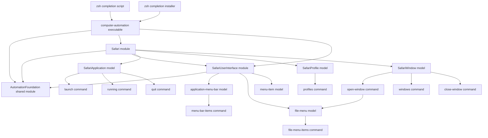

# Architecture

## Module layout

## Notes

- The first architectural level is the module.
- Modules typically represent an application or a service boundary.
- Models represent distinct parts of a module's domain.
- Commands are the next architectural level inside a module.
- Each command belongs to a model and owns its own implementation directory.
- Commands and modules may share code only through an explicit shared type, library, or module boundary.
- UI automation must remain independent of the macOS and Safari language setting.
- Module and command models publish completion metadata that the CLI consumes.
- Shell completion scripts stay thin and delegate to the CLI completion endpoint.
- Shell completion installers stay thin and write generated scripts into shell completion paths.
- The current executable is a thin entry point over the `Safari` and `SafariUserInterface` modules.
