# Architecture

## Module layout

```mermaid
flowchart TD
    App["computer-automation executable"]
    Foundation["AutomationFoundation shared module"]
    Zsh["zsh completion script"]
    ZshInstaller["zsh completion installer"]
    Safari["Safari module"]
    SafariUI["SafariUserInterface module"]
    SafariScript["SafariAppleScript module"]
    SafariApplication["SafariApplication model"]
    SafariProfile["SafariProfile model"]
    SafariWindow["SafariWindow model"]
    SafariTabGroup["SafariTabGroup model"]
    SafariTab["SafariTab model"]
    ScriptApplication["script application model"]
    ScriptWindow["script window model"]
    ScriptTab["script tab model"]
    ScriptMenuBar["script menu bar model"]
    ScriptMenu["script menu model"]
    ScriptMenuItem["script menu item model"]
    SafariMenuBar["application-menu-bar model"]
    SafariMenu["menu model"]
    SafariFileMenu["file-menu model"]
    SafariMenuItem["menu-item model"]
    MenuBarItems["menu-bar-items command"]
    MenuItems["menu-items command"]
    FileMenuItems["file-menu-items command"]
    MenuItemChildren["menu-item-children command"]
    Launch["launch command"]
    Running["running command"]
    Quit["quit command"]
    Profiles["profiles command"]
    WindowOpen["open-window command"]
    WindowOpenPrivate["open-private-window command"]
    Windows["windows command"]
    WindowClose["close-window command"]
    TabGroups["tab-groups command"]
    TabGroupTabs["tab-group-tabs command"]
    TabOpen["open-tab command"]
    Tabs["tabs command"]
    WindowTabs["window-tabs command"]
    TabSetURL["set-tab-url command"]
    TabClose["close-tab command"]

    App --> Foundation
    Zsh --> App
    ZshInstaller --> App
    App --> Safari
    App --> SafariUI
    App --> SafariScript
    Safari --> Foundation
    Safari --> SafariScript
    Safari --> SafariUI
    SafariUI --> Foundation
    SafariUI --> SafariScript
    SafariScript --> Foundation
    Safari --> SafariApplication
    Safari --> SafariProfile
    Safari --> SafariWindow
    Safari --> SafariTabGroup
    Safari --> SafariTab
    SafariScript --> ScriptApplication
    SafariScript --> ScriptWindow
    SafariScript --> ScriptTab
    SafariScript --> ScriptMenuBar
    SafariScript --> ScriptMenu
    SafariScript --> ScriptMenuItem
    SafariUI --> SafariMenuBar
    SafariUI --> SafariMenu
    SafariUI --> SafariFileMenu
    SafariUI --> SafariMenuItem
    SafariMenuBar --> MenuBarItems
    SafariMenu --> MenuItems
    SafariFileMenu --> FileMenuItems
    SafariMenuItem --> MenuItemChildren
    SafariMenu --> SafariMenuItem
    SafariFileMenu --> SafariMenu
    SafariApplication --> Launch
    SafariApplication --> Running
    SafariApplication --> Quit
    SafariProfile --> Profiles
    SafariWindow --> WindowOpen
    SafariWindow --> WindowOpenPrivate
    SafariWindow --> Windows
    SafariWindow --> WindowClose
    SafariTabGroup --> TabGroups
    SafariTabGroup --> TabGroupTabs
    SafariTab --> TabOpen
    SafariTab --> Tabs
    SafariTab --> WindowTabs
    SafariTab --> TabSetURL
    SafariTab --> TabClose
    WindowOpen --> SafariFileMenu
    WindowOpenPrivate --> SafariFileMenu
    SafariTab --> ScriptTab
```

## Notes

- The first architectural level is the module.
- Modules typically represent an application or a service boundary.
- Models represent distinct parts of a module's domain.
- Prefer general structural UI models before adding specialized models for concrete application areas.
- Keep specialized models for behaviors that are genuinely specific to one concrete UI surface.
- Commands are the next architectural level inside a module.
- Each command belongs to a model and owns its own implementation directory.
- Commands and modules may share code only through an explicit shared type, library, or module boundary.
- UI automation must remain independent of the macOS and Safari language setting.
- Direct AppleScript access should live in `SafariAppleScript`, not inside `Safari` or `SafariUserInterface`.
- Saved tab-group metadata currently comes from Safari's local database rather than AppleScript.
- Direct tab CRUD currently lives across `SafariTab` and `SafariAppleScriptTab` because Safari exposes tab URL state directly in AppleScript.
- Module and command models publish completion metadata that the CLI consumes.
- Shell completion scripts stay thin and delegate to the CLI completion endpoint.
- Shell completion installers stay thin and write generated scripts into shell completion paths.
- The current executable is a thin entry point over the `Safari`, `SafariUserInterface`, and `SafariAppleScript` modules.
