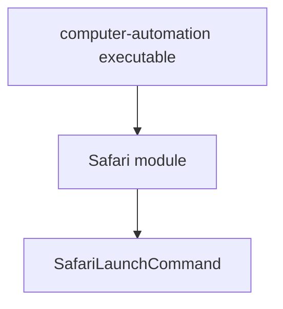

# Architecture

## Module layout

## Notes

- The first architectural level is the module.
- Modules typically represent an application or a service boundary.
- Commands are the next architectural level inside a module.
- Each command owns its own implementation directory.
- Commands and modules may share code only through an explicit shared type, library, or module boundary.
- The current executable is a thin entry point over the `Safari` module and its launch command.
