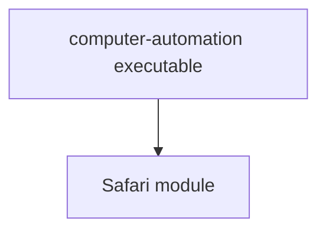

# Architecture

## Module layout

## Notes

- The first architectural level is the module.
- Modules typically represent an application or a service boundary.
- The current executable is a thin entry point over the `Safari` module.
