# Safari AppleScript Models

## Overview

- The `SafariAppleScript` module owns direct AppleScript access to Safari.
- It currently exposes seven models: `SafariAppleScriptApplication`, `SafariAppleScriptWindow`, `SafariAppleScriptTab`, `SafariAppleScriptSidebar`, `SafariAppleScriptApplicationMenuBar`, `SafariAppleScriptMenu`, and `SafariAppleScriptMenuItem`.
- `SafariAppleScriptApplication` represents AppleScript-level access to the Safari application.
- `SafariAppleScriptWindow` represents AppleScript-level access to Safari windows and reads both the window title used for Accessibility reconciliation and the current tab title used for user-facing window names.
- `SafariAppleScriptTab` represents AppleScript-level access to Safari tabs.
- `SafariAppleScriptTab.list()` returns each tab as a structured Apple event list containing the stable window id, current window index, tab index, URL, and title from one enumeration.
- `SafariAppleScriptTab.list(windowIdentifier:)` returns tabs from one stable Safari window id without relying on current window order.
- `SafariAppleScriptTab.executeJavaScript()` targets a Safari tab by stable window id and tab index.
- `SafariAppleScriptSidebar` represents AppleScript-level access to the opened Safari sidebar and its structurally addressable rows.
- `SafariAppleScriptApplicationMenuBar` represents AppleScript-level access to Safari's application menu bar.
- `SafariAppleScriptMenu` represents AppleScript-level access to a top-level Safari menu.
- `SafariAppleScriptMenuItem` represents AppleScript-level access to a Safari menu item and its child items.

## Model surface

| Model | Internal API | Purpose |
| --- | --- | --- |
| `SafariAppleScriptApplication` | `activate()` | Bring Safari to the foreground before UI-oriented script operations. |
| `SafariAppleScriptWindow` | `list()`, `openNewDocument()`, `closeFrontWindow()`, `close(windowIdentifier:)` | Read and mutate Safari window state through AppleScript. |
| `SafariAppleScriptTab` | `list()`, `list(windowIdentifier:)`, `open()`, `open(windowIdentifier:)`, `setURL()`, `setURL(windowIdentifier:)`, `move()`, `move(windowIdentifier:)`, `close()`, `close(windowIdentifier:)`, `executeJavaScript()` | Read and mutate Safari tab state through AppleScript, including concrete-tab JavaScript evaluation. |
| `SafariAppleScriptSidebar` | `selectItem()`, `selectTabGroup()`, `selectTabGroup(identifier:named:)`, `renameTabGroup()` | Select sidebar rows structurally and support the internal post-create tab-group naming flow. |
| `SafariAppleScriptApplicationMenuBar` | `listItems()` | Read top-level Safari menu bar items. |
| `SafariAppleScriptMenu` | `listItems()`, `clickItem()` | Read and invoke items of a top-level Safari menu. |
| `SafariAppleScriptMenuItem` | `listChildItems()` | Read submenu items for a specific Safari menu item. |

## Model architecture

```mermaid
flowchart TD
    SafariAppleScript["SafariAppleScript module"]
    ScriptApp["SafariAppleScriptApplication model"]
    ScriptWindow["SafariAppleScriptWindow model"]
    ScriptTab["SafariAppleScriptTab model"]
    ScriptSidebar["SafariAppleScriptSidebar model"]
    ScriptMenuBar["SafariAppleScriptApplicationMenuBar model"]
    ScriptMenu["SafariAppleScriptMenu model"]
    ScriptMenuItem["SafariAppleScriptMenuItem model"]
    Activate["activate()"]
    ListWindows["list()"]
    OpenDocument["openNewDocument()"]
    CloseWindow["closeFrontWindow()"]
    CloseWindowByID["close(windowIdentifier:)"]
    ListTabs["list()"]
    OpenTab["open()"]
    SetTabURL["setURL()"]
    MoveTab["move()"]
    CloseTab["close()"]
    ExecuteJavaScript["executeJavaScript()"]
    SelectSidebar["selectItem()"]
    SelectTabGroup["selectTabGroup()"]
    RenameTabGroup["renameTabGroup()"]
    ListMenuBar["listItems()"]
    ListMenu["listItems()"]
    ClickMenuItem["clickItem()"]
    ListChildren["listChildItems()"]

    SafariAppleScript --> ScriptApp
    SafariAppleScript --> ScriptWindow
    SafariAppleScript --> ScriptTab
    SafariAppleScript --> ScriptSidebar
    SafariAppleScript --> ScriptMenuBar
    SafariAppleScript --> ScriptMenu
    SafariAppleScript --> ScriptMenuItem
    ScriptApp --> Activate
    ScriptWindow --> ListWindows
    ScriptWindow --> OpenDocument
    ScriptWindow --> CloseWindow
    ScriptWindow --> CloseWindowByID
    ScriptTab --> ListTabs
    ScriptTab --> OpenTab
    ScriptTab --> SetTabURL
    ScriptTab --> MoveTab
    ScriptTab --> CloseTab
    ScriptTab --> ExecuteJavaScript
    ScriptSidebar --> SelectSidebar
    ScriptSidebar --> SelectTabGroup
    ScriptSidebar --> RenameTabGroup
    ScriptMenuBar --> ListMenuBar
    ScriptMenu --> ListMenu
    ScriptMenu --> ClickMenuItem
    ScriptMenuItem --> ListChildren
```

## Notes

- `SafariAppleScript` is an infrastructure module, not a user-facing CLI surface.
- `Safari` and `SafariUserInterface` depend on it through explicit model APIs.
- AppleScript execution itself is isolated in `SafariAppleScriptExecutor`.
- This module owns script parsing artifacts such as AppleScript-derived menu-item, window, and tab records.
- `SafariAppleScriptTab` provides window-index and window-id variants for listing, opening, moving, setting URLs, and closing tabs. Every window-id variant uses the same iterative resolver over `every window` and compares `id of currentWindow` before touching tabs.
- `SafariAppleScriptTab.executeJavaScript()` uses that iterative stable-id resolver and then runs `do JavaScript` in the requested tab index of the resolved window.
- `SafariAppleScriptTab.open(windowIdentifier:)` polls until a newly created stable window id is addressable through AppleScript before it performs the one-shot tab creation.
- `SafariAppleScriptTab.executeJavaScript()` embeds the caller's value-producing expression directly in its result serializer, avoiding page-level `eval` and the corresponding `unsafe-eval` content-security-policy restriction. Primitive results return as text and object/array results return as `JSON.stringify(...)` text.
- `SafariAppleScriptTab.executeJavaScript()` maps missing target sentinels into typed errors and collapses JavaScript/runtime failures into a sanitized execution failure for the addressed window and tab.
- `SafariAppleScriptTab.executeJavaScript()` reports JavaScript results that Safari cannot convert to text as a typed unsupported-result error instead of a generic execution failure.
- `SafariAppleScriptSidebar` includes the low-level bootstrap needed to ensure the Safari sidebar is open before structural row access.
- `SafariAppleScriptSidebar.selectTabGroup(identifier:named:)` first searches sidebar rows for `SidebarLibraryItemTabGroup` accessibility identifiers containing the saved group identifier. It falls back to display-name matching only when none of the tab-group rows exposes a stable identifier; observing other stable identifiers makes a missing requested identifier definitive.
- The higher-level `SafariSidebar` model uses direct Swift accessibility for live sidebar targeting and delete, with AppleScript retained only where it is still needed as a fallback transport.
- `SafariAppleScriptSidebar` remains valuable as:
  - the script transport behind scripted sidebar selection helpers
  - the fallback implementation for the internal post-create tab-group naming path
