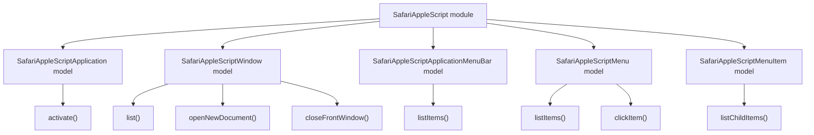

# Safari AppleScript Models

## Overview

- The `SafariAppleScript` module owns direct AppleScript access to Safari.
- It currently exposes five models: `SafariAppleScriptApplication`, `SafariAppleScriptWindow`, `SafariAppleScriptApplicationMenuBar`, `SafariAppleScriptMenu`, and `SafariAppleScriptMenuItem`.
- `SafariAppleScriptApplication` represents AppleScript-level access to the Safari application.
- `SafariAppleScriptWindow` represents AppleScript-level access to Safari windows.
- `SafariAppleScriptApplicationMenuBar` represents AppleScript-level access to Safari's application menu bar.
- `SafariAppleScriptMenu` represents AppleScript-level access to a top-level Safari menu.
- `SafariAppleScriptMenuItem` represents AppleScript-level access to a Safari menu item and its child items.

## Model surface

| Model | Internal API | Purpose |
| --- | --- | --- |
| `SafariAppleScriptApplication` | `activate()` | Bring Safari to the foreground before UI-oriented script operations. |
| `SafariAppleScriptWindow` | `list()`, `openNewDocument()`, `closeFrontWindow()` | Read and mutate Safari window state through AppleScript. |
| `SafariAppleScriptApplicationMenuBar` | `listItems()` | Read top-level Safari menu bar items. |
| `SafariAppleScriptMenu` | `listItems()`, `clickItem()` | Read and invoke items of a top-level Safari menu. |
| `SafariAppleScriptMenuItem` | `listChildItems()` | Read submenu items for a specific Safari menu item. |

## Model architecture

## Notes

- `SafariAppleScript` is an infrastructure module, not a user-facing CLI surface.
- `Safari` and `SafariUserInterface` depend on it through explicit model APIs.
- AppleScript execution itself is isolated in `SafariAppleScriptExecutor`.
- This module owns script parsing artifacts such as AppleScript-derived menu-item and window records.
