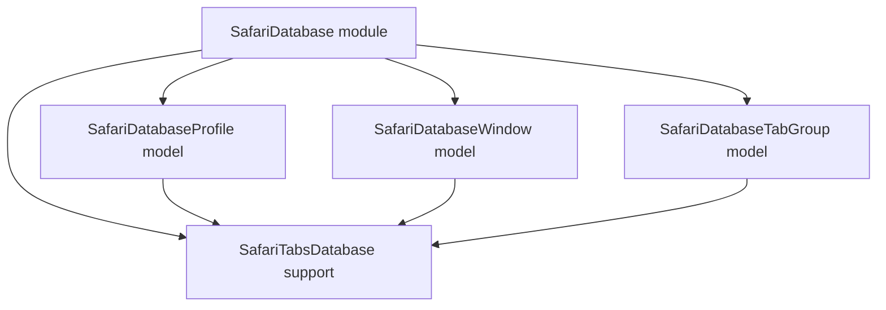

# Safari Database Models

## Overview

- The `SafariDatabase` module owns direct access to Safari's local `SafariTabs.db`.
- It exposes three database entity models: `SafariDatabaseProfile`, `SafariDatabaseWindow`, and `SafariDatabaseTabGroup`.
- `SafariTabsDatabase` owns the database path, open mode, readability preflight, and SQLite busy timeout.
- The `Safari` module consumes this module through explicit record types and maps database records into Safari domain records.

## Entity matrix

| Model | Data | Description |
| --- | --- | --- |
| `SafariDatabaseProfile` | `bookmarks` profile rows | Reads persisted Safari profile names and stable identifiers. |
| `SafariDatabaseWindow` | `windows` rows joined to `bookmarks` | Reads private-window state, active profile name, and selected saved tab-group metadata. |
| `SafariDatabaseTabGroup` | `bookmarks` tab-group rows and descendants | Reads saved tab groups, including root groups with an empty profile name, stored group tabs, and deletes saved group bookmark subtrees. |

## Model architecture

## Notes

- `SafariDatabase` is an infrastructure module, not a user-facing CLI surface.
- Direct SQLite access for `SafariTabs.db` belongs in this module, not in `Safari`.
- `Safari` remains responsible for command ownership, CLI formatting, and higher-level Safari behavior.
- Database model errors use `SafariDatabaseError` for open, query preparation, and query execution failures.
- `SafariDatabaseTabGroup` has a separate `SafariDatabaseTabGroupError.tabGroupNotFound` because missing data is an entity-level result, not a SQLite access failure.
- Root saved tab groups can appear in `bookmarks` with `parent = 0`; the database model exposes those with an empty profile name.
- The database opener preflights file readability and applies a short busy timeout so authorization and lock problems fail quickly.
