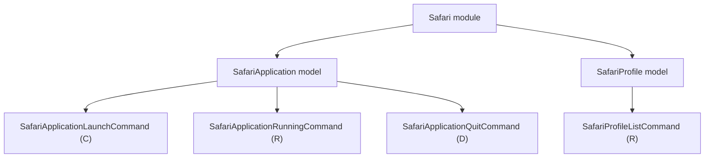

# Safari Models

## Overview

- The `Safari` module currently exposes two models: `SafariApplication` and `SafariProfile`.
- `SafariApplication` represents Safari as an application and owns its lifecycle commands.
- `SafariProfile` represents the profiles available in Safari.

## CRUD matrix

| Model | Command | CRUD | Description |
| --- | --- | --- | --- |
| `SafariApplication` | `launch` | `C` | Start the Safari application. |
| `SafariApplication` | `running` | `R` | Report whether Safari is currently running. |
| `SafariApplication` | `quit` | `D` | Request Safari to terminate. |
| `SafariProfile` | `profiles` | `R` | List available Safari profiles. |

## Model architecture

## Notes

- `launch` is the create operation for the application lifecycle.
- `running` is the read operation for the application lifecycle.
- `quit` is the delete operation for the application lifecycle.
- `profiles` is the read operation for the profile catalog.
- No update operation is currently defined because it does not fit the application lifecycle at this level.
