# Safari Models

## Overview

- The `Safari` module currently exposes five models: `SafariApplication`, `SafariProfile`, `SafariWindow`, `SafariTabGroup`, and `SafariTab`.
- `SafariApplication` represents Safari as an application and owns its lifecycle commands.
- `SafariProfile` represents the profiles available in Safari.
- `SafariWindow` represents browser windows managed by Safari.
- `SafariTabGroup` represents saved Safari tab groups.
- `SafariTab` represents browser tabs managed inside Safari windows.
- Persisted Safari database rows are modeled in the separate `SafariDatabase` module and mapped into these Safari domain models.

## CRUD matrix

| Model | Command | CRUD | Description |
| --- | --- | --- | --- |
| `SafariApplication` | `launch` | `C` | Start the Safari application. |
| `SafariApplication` | `running` | `R` | Report whether Safari is currently running. |
| `SafariApplication` | `quit` | `D` | Request Safari to terminate. |
| `SafariProfile` | `profiles` | `R` | List available Safari profiles. |
| `SafariWindow` | `open-window` | `C` | Open a new Safari browser window. |
| `SafariWindow` | `open-private-window` | `C` | Open a new private Safari browser window. |
| `SafariWindow` | `open-tab-group-window` | `C` | Open a new Safari window for a saved tab group. |
| `SafariWindow` | `windows` | `R` | List open Safari browser windows. |
| `SafariWindow` | `set-window-tab-group` | `U` | Switch a Safari window to a saved tab group. |
| `SafariWindow` | `close-window` | `D` | Close the front Safari browser window. |
| `SafariTabGroup` | `create-tab-group` | `C` | Create a new saved Safari tab group in a specific window. |
| `SafariTabGroup` | `tab-groups` | `R` | List saved Safari tab groups. |
| `SafariTabGroup` | `tab-group-tabs` | `R` | List tabs stored in a saved Safari tab group. |
| `SafariTabGroup` | `delete-tab-group` | `D` | Delete a saved Safari tab group. |
| `SafariTab` | `open-tab` | `C` | Open a new Safari tab in a specific window. |
| `SafariTab` | `tabs` | `R` | List Safari tabs across all open windows. |
| `SafariTab` | `window-tabs` | `R` | List Safari tabs in one window with selected-group match metadata. |
| `SafariTab` | `set-tab-url` | `U` | Update the URL of a Safari tab. |
| `SafariTab` | `close-tab` | `D` | Close a Safari tab. |

## Model architecture

```mermaid
flowchart TD
    SafariModule["Safari module"]
    SafariDatabase["SafariDatabase module"]
    SafariApplication["SafariApplication model"]
    SafariProfile["SafariProfile model"]
    SafariWindow["SafariWindow model"]
    SafariTabGroup["SafariTabGroup model"]
    SafariTab["SafariTab model"]
    DBProfile["SafariDatabaseProfile model"]
    DBWindow["SafariDatabaseWindow model"]
    DBTabGroup["SafariDatabaseTabGroup model"]
    Launch["SafariApplicationLaunchCommand (C)"]
    Running["SafariApplicationRunningCommand (R)"]
    Quit["SafariApplicationQuitCommand (D)"]
    Profiles["SafariProfileListCommand (R)"]
    WindowOpen["SafariWindowOpenCommand (C)"]
    WindowOpenPrivate["SafariWindowOpenPrivateCommand (C)"]
    WindowOpenTabGroup["SafariWindowOpenTabGroupCommand (C)"]
    Windows["SafariWindowListCommand (R)"]
    WindowSetTabGroup["SafariWindowSetTabGroupCommand (U)"]
    WindowClose["SafariWindowCloseCommand (D)"]
    TabGroupCreate["SafariTabGroupCreateCommand (C)"]
    TabGroups["SafariTabGroupListCommand (R)"]
    TabGroupTabs["SafariTabGroupListTabsCommand (R)"]
    TabGroupDelete["SafariTabGroupDeleteCommand (D)"]
    TabOpen["SafariTabOpenCommand (C)"]
    Tabs["SafariTabListCommand (R)"]
    WindowTabs["SafariTabListWindowTabsCommand (R)"]
    TabSetURL["SafariTabSetURLCommand (U)"]
    TabClose["SafariTabCloseCommand (D)"]

    SafariModule --> SafariApplication
    SafariModule --> SafariProfile
    SafariModule --> SafariWindow
    SafariModule --> SafariTabGroup
    SafariModule --> SafariTab
    SafariModule --> SafariDatabase
    SafariDatabase --> DBProfile
    SafariDatabase --> DBWindow
    SafariDatabase --> DBTabGroup
    SafariApplication --> Launch
    SafariApplication --> Running
    SafariApplication --> Quit
    SafariProfile --> Profiles
    SafariProfile --> DBProfile
    SafariWindow --> WindowOpen
    SafariWindow --> WindowOpenPrivate
    SafariWindow --> WindowOpenTabGroup
    SafariWindow --> Windows
    SafariWindow --> WindowSetTabGroup
    SafariWindow --> WindowClose
    SafariWindow --> DBWindow
    SafariTabGroup --> TabGroupCreate
    SafariTabGroup --> TabGroups
    SafariTabGroup --> TabGroupTabs
    SafariTabGroup --> TabGroupDelete
    SafariTabGroup --> DBTabGroup
    SafariTab --> TabOpen
    SafariTab --> Tabs
    SafariTab --> WindowTabs
    SafariTab --> TabSetURL
    SafariTab --> TabClose
```



## Notes

- `launch` is the create operation for the application lifecycle.
- `running` is the read operation for the application lifecycle.
- `quit` is the delete operation for the application lifecycle.
- `profiles` is the read operation for the profile catalog.
- `open-window` is the create operation for the browser window model.
- `open-private-window` is an additional create operation for the browser window model.
- `open-tab-group-window` is another create operation for the browser window model.
- `windows` is the read operation for the browser window model.
- `set-window-tab-group` is the update operation for the browser window model.
- `close-window` is the delete operation for the browser window model.
- `create-tab-group` is the create operation for the saved tab-group model.
- `tab-groups` is the read operation for the saved tab-group model.
- `tab-group-tabs` is the structural read operation for the tabs stored inside a saved tab-group model.
- `delete-tab-group` is the delete operation for the saved tab-group model.
- `open-tab` is the create operation for the browser tab model.
- `tabs` is the read operation for the browser tab model.
- `window-tabs` is the window-scoped read operation for the browser tab model.
- `set-tab-url` is the update operation for the browser tab model.
- `close-tab` is the delete operation for the browser tab model.
- No update operation is currently defined for the application lifecycle or window lifecycle at this level.

## Profile loading

- The `SafariProfile` model delegates persisted profile loading to `SafariDatabaseProfile` in the `SafariDatabase` module.
- `SafariDatabaseProfile` reads profiles from Safari's local tabs database:
  - `~/Library/Containers/com.apple.Safari/Data/Library/Safari/SafariTabs.db`
- The `profiles` command queries the `bookmarks` table.
- A row is treated as a Safari profile when all of these conditions hold:
  - `parent = 0`
  - `type = 1`
  - `subtype = 2`
- The profile display name is read from `title`.
- The stable profile identifier is read from `external_uuid`.

### Query shape

```sql
SELECT title, external_uuid
FROM bookmarks
WHERE parent = 0 AND type = 1 AND subtype = 2
ORDER BY id;
```

### Output shape

- The CLI currently prints one profile name per line.
- Internally the model keeps both:
  - `name`
  - `identifier`
- The Safari domain record is `SafariProfileRecord`; the database entity record is `SafariDatabaseProfileRecord`.

## Window operations

- The `SafariWindow` model delegates user interface work to the `SafariUserInterface` module.
- `open-window` uses the `SafariFileMenu` model in `SafariUserInterface`.
- `open-private-window` also uses the `SafariFileMenu` model in `SafariUserInterface`.
- `open-tab-group-window` and `set-window-tab-group` use reusable toolbar models in `SafariUserInterface`.
- `open-window` accepts an optional profile name argument.
- When a profile argument is provided, the command:
  - validates the profile name against the `SafariProfile` model
  - delegates to the `SafariFileMenu` model to activate Safari
  - clicks the matching profile-specific "new window" menu item
- After opening a window, `open-window` compares AppleScript-visible Safari window ids before and after the operation and appends a stable `window-id|<id>` line to the success output.
- `windows` enumerates `every window` and returns one line per window as:
  - `index|isPrivate|profile|selectedTabGroupIdentifier|tabGroup|name`
- `SafariWindow` delegates persisted window metadata to `SafariDatabaseWindow`.
- The `isPrivate` column is resolved from Safari's local `windows` table by comparing `active_tab_group_id` with `private_tab_group_id` in `SafariDatabaseWindow`.
- The profile column is resolved by joining AppleScript window ids with Safari's local `windows` table and the active profile bookmark title in `SafariTabs.db`.
- The `selectedTabGroupIdentifier` column is the saved tab-group bookmark identifier when the current `active_tab_group_id` points to a saved group.
- The `tabGroup` column is populated only when the current `active_tab_group_id` points to a saved tab group.
- When `SafariTabs.db` cannot be opened, `windows` degrades to AppleScript-visible fields and leaves database-derived fields empty or defaulted.
- Safari also has a virtual private-window profile:
  - it is not a normal profile row in `SafariTabs.db`
  - it should be treated as a special window mode rather than as a persisted user profile
  - window/profile logic must therefore allow profile-like window states that do not map to the persisted profile catalog
- `open-private-window` is the explicit create operation for that virtual private-window mode.
- `open-tab-group-window <identifier>`:
  - resolves the saved tab group structurally from the Safari tab-group catalog
  - opens a new window for that group's profile
  - switches the new front window to the requested saved tab group through Safari's toolbar tab-group picker
- `set-window-tab-group <window-index> <identifier>`:
  - resolves the target window structurally from the Safari window catalog
  - rejects private windows because private windows cannot select saved tab groups
  - requires the target window profile to match the saved tab-group profile
  - brings the target window to the front
  - switches that front window through Safari's toolbar tab-group picker
- `close-window` closes the current front window.

## Saved tab-group operations

- `create-tab-group <window-index> <name>`:
  - focuses the target non-private window
  - uses Safari's accessibility-exposed File-menu item `NewEmptyTabGroupMenuItem` to create a new empty tab group in that window context
  - writes the requested name into Safari's post-create inline edit field for that selected group
  - resolves the newly created saved group structurally through `SafariDatabaseTabGroup`
- `tab-groups` returns one line per saved group as:
  - `identifier|profile|name`
- `delete-tab-group <identifier>`:
  - resolves the saved group structurally from the persisted catalog
  - focuses an existing non-private window for the same profile or opens one if needed
  - selects the target group in the Safari sidebar
  - opens the selected group's accessibility context menu
  - invokes `DeleteTabGroupMenuItem`
- `tab-group-tabs` returns one line per stored tab as:
  - `index|url`
- `SafariTabGroup` delegates persisted saved-group records and stored group tabs to `SafariDatabaseTabGroup`.
- A bookmark is treated as a saved tab group when:
  - `type = 1`
  - `subtype = 0`
  - its parent is a Safari profile bookmark
  - it has a child bookmark with `type = 1` and `subtype = 1`
- This intentionally excludes internal `Local` and `Private` groups.
- `create-tab-group` rejects duplicate names within the same profile because live Safari selection is still name-based in the toolbar picker.
- `tab-group-tabs <identifier>` reads child bookmark rows of that saved group:
  - only child rows with `type = 0` are treated as stored tabs
  - rows are ordered by `order_index`, then `id`
  - the current model reads only the URL property, so output is limited to `index|url`
- Saved tab-group selection in live windows is currently driven by Safari's toolbar UI:
  - the target toolbar item is resolved structurally through an accessibility identifier that starts with `TabGroupPickerButton`
  - the child menu of that toolbar item exposes saved groups by their display names, so duplicate group names within the same profile are treated as ambiguous and rejected by the automation layer
- Saved tab-group create/delete uses a different live UI path:
  - the target group is selected structurally in the opened sidebar when the operation targets an existing saved group
  - create uses the File-menu item `NewEmptyTabGroupMenuItem`
  - delete uses the selected sidebar group's context-menu item `DeleteTabGroupMenuItem`
  - create then writes the name into the inline text field that Safari exposes immediately after creating a new empty tab group
- A standalone rename command is intentionally not exposed at the moment:
  - Safari visibly offers rename in the sidebar UI
  - but the corresponding trigger has not been found on a stable accessibility surface
  - the CLI therefore does not promise a rename operation it cannot verify reliably
- A possible future workaround is a replacement operation:
  - create a new saved group with the requested name
  - copy the old group's stored tabs into the new group
  - delete the old group
  - this must not be documented or implemented as true rename because it changes the saved group identifier
  - it may also lose Safari metadata that the current model does not read or reproduce, such as non-URL tab state

## Tab operations

- Each Safari window is treated as an ordered container of tabs.
- A tab belongs to a window, and the window owns whether it is private or not.
- Private mode is therefore a window property, not a tab property.
- Tabs are addressed structurally by:
  - `window-index`
  - `tab-index`
- `open-tab` creates a new tab inside a specific window and accepts:
  - a required `window-index`
  - an optional `url`
- `tabs` returns one line per tab as:
  - `windowIndex|tabIndex|url`
- `find-tab <url>` searches open Safari tabs by URL and returns one line per match as:
  - `windowId|windowIndex|tabIndex|url|title`
- `find-tab` uses exact URL matching by default.
- `find-tab --prefix` matches tabs whose URL starts with the requested URL.
- `find-tab --window-id <id>` and `find-tab --window-index <index>` narrow matches to one Safari window.
- `find-tab --profile <name>` narrows matches to windows whose profile metadata is available through `SafariWindow`.
- `window-tabs <window-index>` returns one line per tab as:
  - `tabIndex|selectedTabGroupTabIndex|url`
- `window-tabs` compares live tabs with the currently selected saved tab group of that window.
- A live tab is currently treated as coming from the selected saved tab group only when:
  - a selected saved tab group exists for the window
  - the saved-group tab exists at the same tab index
  - the saved-group tab URL equals the live tab URL
- `set-tab-url` updates the URL of a specific tab identified by `window-index` and `tab-index`.
- `close-tab` closes a specific tab identified by `window-index` and `tab-index`.
- `find-tab` combines AppleScript tab data with Safari window ids and profile metadata from the `SafariWindow` model.
- The `SafariTab` model currently delegates tab CRUD work directly to the `SafariAppleScript` module because Safari exposes tab URL mutation directly through AppleScript.

## Related module

- GUI scripting and menu-level automation live in the separate `SafariUserInterface` module.
- Direct AppleScript access lives in the separate `SafariAppleScript` module.
- Its models are documented in `docs/safari-user-interface-models.md`.
- AppleScript models are documented in `docs/safari-applescript-models.md`.
- `SafariFileMenu` is the current specialized integration point used by the `SafariWindow` model.
- `SafariMenu` is the general top-level menu abstraction in that module.
- Profile-specific window opening resolves the target File-menu item through `SafariUserInterface` without depending on the localized menu title.
- Private-window opening resolves the target File-menu item through shortcut metadata instead of localized menu titles.
- Structured submenu inspection is available through the `SafariMenuItem` model in `SafariUserInterface`.
- Saved tab-group switching currently routes through reusable toolbar and toolbar-item models in `SafariUserInterface`.
- Saved tab-group creation currently resolves Safari's built-in "new empty tab group" command through the stable File-menu accessibility identifier `NewEmptyTabGroupMenuItem`.
- Tab CRUD currently bypasses `SafariUserInterface` because it does not require menu or accessibility interaction.
- Direct `SafariTabs.db` reads and writes live in the separate `SafariDatabase` module.
