# Safari Models

## Overview

- The `Safari` module currently exposes four models: `SafariApplication`, `SafariProfile`, `SafariWindow`, and `SafariTab`.
- `SafariApplication` represents Safari as an application and owns its lifecycle commands.
- `SafariProfile` represents the profiles available in Safari.
- `SafariWindow` represents browser windows managed by Safari.
- `SafariTab` represents browser tabs managed inside Safari windows.

## CRUD matrix

| Model | Command | CRUD | Description |
| --- | --- | --- | --- |
| `SafariApplication` | `launch` | `C` | Start the Safari application. |
| `SafariApplication` | `running` | `R` | Report whether Safari is currently running. |
| `SafariApplication` | `quit` | `D` | Request Safari to terminate. |
| `SafariProfile` | `profiles` | `R` | List available Safari profiles. |
| `SafariWindow` | `open-window` | `C` | Open a new Safari browser window. |
| `SafariWindow` | `windows` | `R` | List open Safari browser windows. |
| `SafariWindow` | `close-window` | `D` | Close the front Safari browser window. |
| `SafariTab` | `open-tab` | `C` | Open a new Safari tab in a specific window. |
| `SafariTab` | `tabs` | `R` | List Safari tabs across all open windows. |
| `SafariTab` | `set-tab-url` | `U` | Update the URL of a Safari tab. |
| `SafariTab` | `close-tab` | `D` | Close a Safari tab. |

## Model architecture

```mermaid
flowchart TD
    SafariModule["Safari module"]
    SafariApplication["SafariApplication model"]
    SafariProfile["SafariProfile model"]
    SafariWindow["SafariWindow model"]
    SafariTab["SafariTab model"]
    Launch["SafariApplicationLaunchCommand (C)"]
    Running["SafariApplicationRunningCommand (R)"]
    Quit["SafariApplicationQuitCommand (D)"]
    Profiles["SafariProfileListCommand (R)"]
    WindowOpen["SafariWindowOpenCommand (C)"]
    Windows["SafariWindowListCommand (R)"]
    WindowClose["SafariWindowCloseCommand (D)"]
    TabOpen["SafariTabOpenCommand (C)"]
    Tabs["SafariTabListCommand (R)"]
    TabSetURL["SafariTabSetURLCommand (U)"]
    TabClose["SafariTabCloseCommand (D)"]

    SafariModule --> SafariApplication
    SafariModule --> SafariProfile
    SafariModule --> SafariWindow
    SafariModule --> SafariTab
    SafariApplication --> Launch
    SafariApplication --> Running
    SafariApplication --> Quit
    SafariProfile --> Profiles
    SafariWindow --> WindowOpen
    SafariWindow --> Windows
    SafariWindow --> WindowClose
    SafariTab --> TabOpen
    SafariTab --> Tabs
    SafariTab --> TabSetURL
    SafariTab --> TabClose
```



## Notes

- `launch` is the create operation for the application lifecycle.
- `running` is the read operation for the application lifecycle.
- `quit` is the delete operation for the application lifecycle.
- `profiles` is the read operation for the profile catalog.
- `open-window` is the create operation for the browser window model.
- `windows` is the read operation for the browser window model.
- `close-window` is the delete operation for the browser window model.
- `open-tab` is the create operation for the browser tab model.
- `tabs` is the read operation for the browser tab model.
- `set-tab-url` is the update operation for the browser tab model.
- `close-tab` is the delete operation for the browser tab model.
- No update operation is currently defined for the application lifecycle or window lifecycle at this level.

## Profile loading

- The `SafariProfile` model reads profiles from Safari's local tabs database:
  - `~/Library/Containers/com.apple.Safari/Data/Library/Safari/SafariTabs.db`
- The `profiles` command queries the `bookmarks` table.
- A row is treated as a Safari profile when all of these conditions hold:
  - `parent = 0`
  - `type = 1`
  - `subtype = 2`
- The profile display name is read from `title`.
- The stable profile identifier is read from `external_uuid`.

### Query shape

```sql
SELECT title, external_uuid
FROM bookmarks
WHERE parent = 0 AND type = 1 AND subtype = 2
ORDER BY id;
```

### Output shape

- The CLI currently prints one profile name per line.
- Internally the model keeps both:
  - `name`
  - `identifier`

## Window operations

- The `SafariWindow` model delegates user interface work to the `SafariUserInterface` module.
- `open-window` uses the `SafariFileMenu` model in `SafariUserInterface`.
- `open-window` accepts an optional profile name argument.
- When a profile argument is provided, the command:
  - validates the profile name against the `SafariProfile` model
  - delegates to the `SafariFileMenu` model to activate Safari
  - clicks the matching profile-specific "new window" menu item
- `windows` enumerates `every window` and returns one line per window as:
  - `index|profile|name`
- The profile column is resolved by joining AppleScript window ids with Safari's local `windows` table and the active profile bookmark title in `SafariTabs.db`.
- Safari also has a virtual private-window profile:
  - it is not a normal profile row in `SafariTabs.db`
  - it should be treated as a special window mode rather than as a persisted user profile
  - window/profile logic must therefore allow profile-like window states that do not map to the persisted profile catalog
- `close-window` closes the current front window.

## Tab operations

- Each Safari window is treated as an ordered container of tabs.
- Tabs are addressed structurally by:
  - `window-index`
  - `tab-index`
- `open-tab` creates a new tab inside a specific window and accepts:
  - a required `window-index`
  - an optional `url`
- `tabs` returns one line per tab as:
  - `windowIndex|tabIndex|url`
- `set-tab-url` updates the URL of a specific tab identified by `window-index` and `tab-index`.
- `close-tab` closes a specific tab identified by `window-index` and `tab-index`.
- The `SafariTab` model currently delegates all tab CRUD work directly to the `SafariAppleScript` module because Safari exposes tab URL mutation directly through AppleScript.

## Related module

- GUI scripting and menu-level automation live in the separate `SafariUserInterface` module.
- Direct AppleScript access lives in the separate `SafariAppleScript` module.
- Its models are documented in `docs/safari-user-interface-models.md`.
- AppleScript models are documented in `docs/safari-applescript-models.md`.
- `SafariFileMenu` is the current specialized integration point used by the `SafariWindow` model.
- `SafariMenu` is the general top-level menu abstraction in that module.
- Profile-specific window opening resolves the target File-menu item through `SafariUserInterface` without depending on the localized menu title.
- Structured submenu inspection is available through the `SafariMenuItem` model in `SafariUserInterface`.
- Tab CRUD currently bypasses `SafariUserInterface` because it does not require menu or accessibility interaction.
