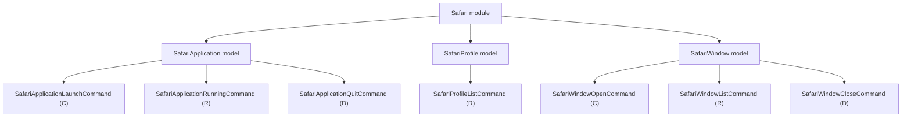

# Safari Models

## Overview

- The `Safari` module currently exposes three models: `SafariApplication`, `SafariProfile`, and `SafariWindow`.
- `SafariApplication` represents Safari as an application and owns its lifecycle commands.
- `SafariProfile` represents the profiles available in Safari.
- `SafariWindow` represents browser windows managed by Safari.

## CRUD matrix

| Model | Command | CRUD | Description |
| --- | --- | --- | --- |
| `SafariApplication` | `launch` | `C` | Start the Safari application. |
| `SafariApplication` | `running` | `R` | Report whether Safari is currently running. |
| `SafariApplication` | `quit` | `D` | Request Safari to terminate. |
| `SafariProfile` | `profiles` | `R` | List available Safari profiles. |
| `SafariWindow` | `open-window` | `C` | Open a new Safari browser window. |
| `SafariWindow` | `windows` | `R` | List open Safari browser windows. |
| `SafariWindow` | `close-window` | `D` | Close the front Safari browser window. |

## Model architecture



## Notes

- `launch` is the create operation for the application lifecycle.
- `running` is the read operation for the application lifecycle.
- `quit` is the delete operation for the application lifecycle.
- `profiles` is the read operation for the profile catalog.
- `open-window` is the create operation for the browser window model.
- `windows` is the read operation for the browser window model.
- `close-window` is the delete operation for the browser window model.
- No update operation is currently defined because it does not fit the application lifecycle at this level.

## Profile loading

- The `SafariProfile` model reads profiles from Safari's local tabs database:
  - `~/Library/Containers/com.apple.Safari/Data/Library/Safari/SafariTabs.db`
- The `profiles` command queries the `bookmarks` table.
- A row is treated as a Safari profile when all of these conditions hold:
  - `parent = 0`
  - `type = 1`
  - `subtype = 2`
- The profile display name is read from `title`.
- The stable profile identifier is read from `external_uuid`.

### Query shape

```sql
SELECT title, external_uuid
FROM bookmarks
WHERE parent = 0 AND type = 1 AND subtype = 2
ORDER BY id;
```

### Output shape

- The CLI currently prints one profile name per line.
- Internally the model keeps both:
  - `name`
  - `identifier`

## Window operations

- The `SafariWindow` model uses AppleScript to interact with Safari windows.
- `open-window` activates Safari and runs `make new document`.
- `windows` enumerates `every window` and returns one line per window as:
  - `index|name`
- `close-window` closes the current front window.
