# Safari Models

## Overview

- The `Safari` module currently exposes six models: `SafariApplication`, `SafariProfile`, `SafariWindow`, `SafariTabGroup`, `SafariTabList`, and `SafariTab`.
- `SafariApplication` represents Safari as an application and owns its lifecycle commands.
- `SafariProfile` represents the profiles available in Safari.
- `SafariWindow` represents browser windows managed by Safari.
- `SafariTabGroup` represents saved Safari tab groups.
- `SafariTabList` is a virtual model for ordered tab lists backed by windows or saved tab groups.
- `SafariTab` represents browser tabs managed inside Safari windows.
- Persisted Safari database rows are modeled in the separate `SafariDatabase` module and mapped into these Safari domain models.

## CRUD matrix

| Model | Command | CRUD | Description |
| --- | --- | --- | --- |
| `SafariApplication` | `launch` | `C` | Start the Safari application. |
| `SafariApplication` | `running` | `R` | Report whether Safari is currently running. |
| `SafariApplication` | `quit` | `D` | Request Safari to terminate. |
| `SafariProfile` | `profiles` | `R` | List available Safari profiles. |
| `SafariProfile` | `find-profile` | `R` | Find Safari profiles by name. |
| `SafariProfile` | `resolve-profile` | `R` | Resolve exactly one Safari profile by name. |
| `SafariWindow` | `open-window` | `C` | Open a new Safari browser window. |
| `SafariWindow` | `open-private-window` | `C` | Open a new private Safari browser window. |
| `SafariWindow` | `open-tab-group-window` | `C` | Open a new Safari window for a saved tab group. |
| `SafariWindow` | `windows` | `R` | List open Safari browser windows. |
| `SafariWindow` | `set-window-tab-group` | `U` | Switch a Safari window to a saved tab group. |
| `SafariWindow` | `close-window` | `D` | Close the front Safari browser window. |
| `SafariTabGroup` | `create-tab-group` | `C` | Create a new saved Safari tab group in a specific window. |
| `SafariTabGroup` | `ensure-tab-group` | `C` | Create or reuse a saved Safari tab group by profile and name. |
| `SafariTabGroup` | `tab-groups` | `R` | List saved Safari tab groups. |
| `SafariTabGroup` | `find-tab-group` | `R` | Find saved Safari tab groups by profile and name. |
| `SafariTabGroup` | `resolve-tab-group` | `R` | Resolve exactly one saved Safari tab group by profile and name. |
| `SafariTabGroup` | `delete-tab-group` | `D` | Delete a saved Safari tab group. |
| `SafariTabList` | `ensure-tab-list-urls` | `U` | Add missing requested URLs to a window-backed or saved-tab-group-backed tab list. |
| `SafariTabList` | `reorder-tab-list-urls` | `U` | Reorder existing matching tabs in a tab list to match requested URL order. |
| `SafariTabList` | `tab-group-tabs` | `R` | List tabs stored in a saved Safari tab group. |
| `SafariTabList` | `window-tabs` | `R` | List Safari tabs in one window with selected-group match metadata. |
| `SafariTab` | `open-tab` | `C` | Open a new Safari tab in a specific window. |
| `SafariTab` | `tabs` | `R` | List Safari tabs across all open windows. |
| `SafariTab` | `find-tab` | `R` | Find open Safari tabs by URL. |
| `SafariTab` | `resolve-tab` | `R` | Resolve exactly one open Safari tab by URL. |
| `SafariTab` | `execute-tab-javascript` | `R` | Execute JavaScript in a concrete Safari tab. |
| `SafariTab` | `set-tab-url` | `U` | Update the URL of a Safari tab. |
| `SafariTab` | `close-tab` | `D` | Close a Safari tab. |

## Model architecture

```mermaid
flowchart TD
    SafariModule["Safari module"]
    SafariDatabase["SafariDatabase module"]
    SafariApplication["SafariApplication model"]
    SafariProfile["SafariProfile model"]
    SafariWindow["SafariWindow model"]
    SafariTabGroup["SafariTabGroup model"]
    SafariTabList["SafariTabList model"]
    SafariTab["SafariTab model"]
    DBProfile["SafariDatabaseProfile model"]
    DBWindow["SafariDatabaseWindow model"]
    DBTabGroup["SafariDatabaseTabGroup model"]
    Launch["SafariApplicationLaunchCommand (C)"]
    Running["SafariApplicationRunningCommand (R)"]
    Quit["SafariApplicationQuitCommand (D)"]
    Profiles["SafariProfileListCommand (R)"]
    ProfileFind["SafariProfileFindCommand (R)"]
    ProfileResolve["SafariProfileResolveCommand (R)"]
    WindowOpen["SafariWindowOpenCommand (C)"]
    WindowOpenPrivate["SafariWindowOpenPrivateCommand (C)"]
    WindowOpenTabGroup["SafariWindowOpenTabGroupCommand (C)"]
    Windows["SafariWindowListCommand (R)"]
    WindowSetTabGroup["SafariWindowSetTabGroupCommand (U)"]
    WindowClose["SafariWindowCloseCommand (D)"]
    TabGroupCreate["SafariTabGroupCreateCommand (C)"]
    TabGroupEnsure["SafariTabGroupEnsureCommand (C)"]
    TabGroups["SafariTabGroupListCommand (R)"]
    TabGroupFind["SafariTabGroupFindCommand (R)"]
    TabGroupResolve["SafariTabGroupResolveCommand (R)"]
    EnsureTabListURLs["SafariTabListEnsureURLsCommand (U)"]
    ReorderTabListURLs["SafariTabListReorderURLsCommand (U)"]
    TabGroupTabs["SafariTabListTabGroupTabsCommand (R)"]
    WindowTabs["SafariTabListWindowTabsCommand (R)"]
    TabGroupDelete["SafariTabGroupDeleteCommand (D)"]
    TabOpen["SafariTabOpenCommand (C)"]
    Tabs["SafariTabListCommand (R)"]
    TabFind["SafariTabFindCommand (R)"]
    TabResolve["SafariTabResolveCommand (R)"]
    TabExecuteJavaScript["SafariTabExecuteJavaScriptCommand (R)"]
    TabSetURL["SafariTabSetURLCommand (U)"]
    TabClose["SafariTabCloseCommand (D)"]

    SafariModule --> SafariApplication
    SafariModule --> SafariProfile
    SafariModule --> SafariWindow
    SafariModule --> SafariTabGroup
    SafariModule --> SafariTabList
    SafariModule --> SafariTab
    SafariModule --> SafariDatabase
    SafariDatabase --> DBProfile
    SafariDatabase --> DBWindow
    SafariDatabase --> DBTabGroup
    SafariApplication --> Launch
    SafariApplication --> Running
    SafariApplication --> Quit
    SafariProfile --> Profiles
    SafariProfile --> ProfileFind
    SafariProfile --> ProfileResolve
    SafariProfile --> DBProfile
    SafariWindow --> WindowOpen
    SafariWindow --> WindowOpenPrivate
    SafariWindow --> WindowOpenTabGroup
    SafariWindow --> Windows
    SafariWindow --> WindowSetTabGroup
    SafariWindow --> WindowClose
    SafariWindow --> DBWindow
    SafariTabGroup --> TabGroupCreate
    SafariTabGroup --> TabGroupEnsure
    SafariTabGroup --> TabGroups
    SafariTabGroup --> TabGroupFind
    SafariTabGroup --> TabGroupResolve
    SafariTabGroup --> TabGroupDelete
    SafariTabGroup --> DBTabGroup
    SafariWindow --> SafariTabList
    SafariTabGroup --> SafariTabList
    SafariTabList --> EnsureTabListURLs
    SafariTabList --> ReorderTabListURLs
    SafariTabList --> TabGroupTabs
    SafariTabList --> WindowTabs
    SafariTab --> TabOpen
    SafariTab --> Tabs
    SafariTab --> TabFind
    SafariTab --> TabResolve
    SafariTab --> TabExecuteJavaScript
    SafariTab --> TabSetURL
    SafariTab --> TabClose
```



## Notes

- `launch` is the create operation for the application lifecycle.
- `running` is the read operation for the application lifecycle.
- `quit` is the delete operation for the application lifecycle.
- `profiles` is the read operation for the profile catalog.
- `find-profile` is a read operation that returns zero, one, or many profile matches.
- `resolve-profile` is a read operation that returns exactly one profile match and treats zero or multiple matches as errors.
- `open-window` is the create operation for the browser window model.
- `open-private-window` is an additional create operation for the browser window model.
- `open-tab-group-window` is another create operation for the browser window model.
- `windows` is the read operation for the browser window model.
- `set-window-tab-group` is the update operation for the browser window model.
- `close-window` is the delete operation for the browser window model.
- `create-tab-group` is the create operation for the saved tab-group model.
- `ensure-tab-group` is a create-or-reuse operation for the saved tab-group model and reports whether it created or reused the target group.
- `tab-groups` is the read operation for the saved tab-group model.
- `find-tab-group` is a read operation that returns zero, one, or many saved tab-group matches.
- `resolve-tab-group` is a read operation that returns exactly one saved tab-group match and treats zero or multiple matches as errors.
- `delete-tab-group` is the delete operation for the saved tab-group model.
- `ensure-tab-list-urls` is an update operation for the virtual tab-list model because it reconciles the requested URL set against an existing ordered list.
- `reorder-tab-list-urls` is an update operation for the virtual tab-list model because it mutates the order of existing matching tabs.
- `tab-group-tabs` is a structural read operation on the virtual tab-list model for a saved tab-group-backed ordered list.
- `window-tabs` is a structural read operation on the virtual tab-list model for a window-backed ordered list.
- `open-tab` is the create operation for the browser tab model.
- `tabs` is the read operation for the browser tab model.
- `find-tab` is a read operation that returns zero, one, or many tab matches.
- `resolve-tab` is a read operation that returns exactly one tab match and treats zero or multiple matches as errors.
- `execute-tab-javascript` is a read operation because Safari evaluates page JavaScript and returns the result without changing the modeled tab address.
- `set-tab-url` is the update operation for the browser tab model.
- `close-tab` is the delete operation for the browser tab model.
- No update operation is currently defined for the application lifecycle or window lifecycle at this level.

## Profile loading

- The `SafariProfile` model delegates persisted profile loading to `SafariDatabaseProfile` in the `SafariDatabase` module.
- `SafariDatabaseProfile` reads profiles from Safari's local tabs database:
  - `~/Library/Containers/com.apple.Safari/Data/Library/Safari/SafariTabs.db`
- The `profiles` command queries the `bookmarks` table.
- A row is treated as a Safari profile when all of these conditions hold:
  - `parent = 0`
  - `type = 1`
  - `subtype = 2`
- The profile display name is read from `title`.
- The stable profile identifier is read from `external_uuid`.

### Query shape

```sql
SELECT title, external_uuid
FROM bookmarks
WHERE parent = 0 AND type = 1 AND subtype = 2
ORDER BY id;
```

### Output shape

- The CLI currently prints one profile name per line.
- `find-profile <name>` returns matching profiles as:
  - `identifier|name`
- `resolve-profile <name>` returns the same single row shape and fails unless exactly one profile matches.
- `--json safari find-profile <name>` returns `name` and a `matches` array.
- `--json safari resolve-profile <name>` returns `name` and a single `match` object.
- Internally the model keeps both:
  - `name`
  - `identifier`
- The Safari domain record is `SafariProfileRecord`; the database entity record is `SafariDatabaseProfileRecord`.

## Window operations

- The `SafariWindow` model delegates user interface work to the `SafariUserInterface` module.
- `open-window` uses the `SafariFileMenu` model in `SafariUserInterface`.
- `open-private-window` also uses the `SafariFileMenu` model in `SafariUserInterface`.
- `open-tab-group-window` and `set-window-tab-group` use reusable toolbar models in `SafariUserInterface`.
- `open-window` accepts an optional profile name argument.
- When a profile argument is provided, the command:
  - validates the profile name against the `SafariProfile` model
  - delegates to the `SafariFileMenu` model to activate Safari
  - clicks the matching profile-specific "new window" menu item
- After opening a window, `open-window` compares AppleScript-visible Safari window ids before and after the operation and appends a stable `window-id|<id>` line to the success output.
- `windows` enumerates `every window` and returns one line per window as:
  - `index|isPrivate|profile|selectedTabGroupIdentifier|tabGroup|name`
- `SafariWindow` delegates persisted window metadata to `SafariDatabaseWindow`.
- The `isPrivate` column is resolved from Safari's local `windows` table by comparing `active_tab_group_id` with `private_tab_group_id` in `SafariDatabaseWindow`.
- The profile column is resolved by joining AppleScript window ids with Safari's local `windows` table and the active profile bookmark title in `SafariTabs.db`.
- The `selectedTabGroupIdentifier` column is the saved tab-group bookmark identifier when the current `active_tab_group_id` points to a saved group.
- The `tabGroup` column is populated only when the current `active_tab_group_id` points to a saved tab group.
- When `SafariTabs.db` cannot be opened, `windows` degrades to AppleScript-visible fields and leaves database-derived fields empty or defaulted.
- Safari also has a virtual private-window profile:
  - it is not a normal profile row in `SafariTabs.db`
  - it should be treated as a special window mode rather than as a persisted user profile
  - window/profile logic must therefore allow profile-like window states that do not map to the persisted profile catalog
- `open-private-window` is the explicit create operation for that virtual private-window mode.
- `open-tab-group-window <identifier>`:
  - resolves the saved tab group structurally from the Safari tab-group catalog
  - opens a new window for that group's profile
  - switches the new front window to the requested saved tab group through Safari's toolbar tab-group picker
- `set-window-tab-group <window-index> <identifier>`:
  - resolves the target window structurally from the Safari window catalog
  - rejects private windows because private windows cannot select saved tab groups
  - requires the target window profile to match the saved tab-group profile
  - brings the target window to the front
  - switches that front window through Safari's toolbar tab-group picker
- `close-window` closes the current front window.

## Saved tab-group operations

- `create-tab-group <window-index> <name>`:
  - focuses the target non-private window
  - uses Safari's accessibility-exposed File-menu item `NewEmptyTabGroupMenuItem` to create a new empty tab group in that window context
  - writes the requested name into Safari's post-create inline edit field for that selected group
  - resolves the newly created saved group structurally through `SafariDatabaseTabGroup`
- `ensure-tab-group <profile> <name>`:
  - reuses exactly one existing saved group when the profile/name lookup is unambiguous
  - opens or focuses a non-private window for the requested profile when the group is missing
  - delegates creation to the same create flow as `create-tab-group`
  - fails on ambiguous existing groups rather than creating another duplicate
  - text output reports `created` or `reused` and then prints `identifier|profile|name`
  - JSON output returns `status` and `tabGroup`
- `tab-groups` returns one line per saved group as:
  - `identifier|profile|name`
- `find-tab-group <profile> <name>` returns matching saved groups as:
  - `identifier|profile|name`
- `resolve-tab-group <profile> <name>` returns the same single row shape and fails unless exactly one saved group matches.
- `--json safari find-tab-group <profile> <name>` returns `profileName`, `name`, and a `matches` array.
- `--json safari resolve-tab-group <profile> <name>` returns `profileName`, `name`, and a single `match` object.
- `delete-tab-group <identifier>`:
  - resolves the saved group structurally from the persisted catalog
  - focuses an existing non-private window for the same profile or opens one if needed
  - selects the target group in the Safari sidebar
  - opens the selected group's accessibility context menu
  - invokes `DeleteTabGroupMenuItem`
- `SafariTabGroup` delegates persisted saved-group records to `SafariDatabaseTabGroup`.
- A bookmark is treated as a saved tab group when:
  - `type = 1`
  - `subtype = 0`
  - its parent is a Safari profile bookmark
  - it has a child bookmark with `type = 1` and `subtype = 1`
- This intentionally excludes internal `Local` and `Private` groups.
- `create-tab-group` rejects duplicate names within the same profile because live Safari selection is still name-based in the toolbar picker.
- Saved tab-group selection in live windows is currently driven by Safari's toolbar UI:
  - the target toolbar item is resolved structurally through an accessibility identifier that starts with `TabGroupPickerButton`
  - the child menu of that toolbar item exposes saved groups by their display names, so duplicate group names within the same profile are treated as ambiguous and rejected by the automation layer
- Saved tab-group create/delete uses a different live UI path:
  - the target group is selected structurally in the opened sidebar when the operation targets an existing saved group
  - create uses the File-menu item `NewEmptyTabGroupMenuItem`
  - delete uses the selected sidebar group's context-menu item `DeleteTabGroupMenuItem`
  - create then writes the name into the inline text field that Safari exposes immediately after creating a new empty tab group
- A standalone rename command is intentionally not exposed at the moment:
  - Safari visibly offers rename in the sidebar UI
  - but the corresponding trigger has not been found on a stable accessibility surface
  - the CLI therefore does not promise a rename operation it cannot verify reliably
- A possible future workaround is a replacement operation:
  - create a new saved group with the requested name
  - copy the old group's stored tabs into the new group
  - delete the old group
  - this must not be documented or implemented as true rename because it changes the saved group identifier
  - it may also lose Safari metadata that the current model does not read or reproduce, such as non-URL tab state

## Tab-list operations

- `SafariTabList` is a virtual model for ordered lists of tabs.
- A tab list can be backed by:
  - a live Safari window
  - a saved Safari tab group
- `SafariWindow` and `SafariTabGroup` provide addressable contexts for tab lists, but URL-oriented collection operations belong to the tab-list surface.
- Individual URL values remain properties of `SafariTab` or stored tab records; `SafariTabList` owns collection-level operations over those ordered items.
- `ensure-tab-list-urls --window-index <index> <url>...` reconciles requested URLs against a live window-backed tab list:
  - existing URLs are skipped
  - missing URLs are opened as new tabs in requested order
  - duplicate requested URLs are skipped after the first add or existing match
  - text output reports the window context and one `added|url` or `skipped|url` row per requested URL outcome
  - JSON output returns `context`, `addedURLs`, and `skippedURLs`
- `ensure-tab-list-urls --tab-group-profile <profile> --tab-group-name <name> <url>...` reconciles requested URLs against a saved-tab-group-backed tab list:
  - first delegates to `ensure-tab-group` and preserves the resulting `created` or `reused` status in text and JSON output
  - focuses or opens a compatible non-private Safari window
  - selects the saved tab group in that window before opening missing URLs
  - existing stored tab URLs are skipped
  - missing URLs are opened as new tabs in requested order
  - the command does not reorder existing tabs and does not remove extra tabs
- `reorder-tab-list-urls --window-index <index> <url>...` reorders existing matching tabs in a live window-backed tab list:
  - each requested URL occurrence consumes the first unused existing tab with the same URL
  - matched requested tabs are moved into the requested order as the list prefix
  - unmatched existing tabs remain after that prefix and keep their previous relative order
  - requested URL occurrences without an existing match are reported as missing
  - the command does not create missing tabs and does not delete extra tabs
  - text and JSON output report moved, unchanged, missing, and extra entries
- `reorder-tab-list-urls --tab-group-profile <profile> --tab-group-name <name> <url>...` applies the same reorder semantics to a saved-tab-group-backed tab list:
  - first delegates to `ensure-tab-group` and preserves the resulting `created` or `reused` status in text and JSON output
  - focuses or opens a compatible non-private Safari window
  - selects the saved tab group in that window before moving tabs
  - verifies the saved group's stored tab order after live tab moves
  - fails if Safari does not expose the persisted reordered group order through `tab-group-tabs`
- `tab-group-tabs <identifier>` reads child bookmark rows of a saved group as a saved tab-group-backed tab list:
  - only child rows with `type = 0` are treated as stored tabs
  - rows are ordered by `order_index`, then `id`
  - the current model reads only the URL property, so output is limited to `index|url`
- `window-tabs <window-index>` reads a live window-backed tab list and returns one line per tab as:
  - `tabIndex|selectedTabGroupTabIndex|url`
- `window-tabs` compares live tabs with the currently selected saved tab group of that window.
- A live tab is currently treated as coming from the selected saved tab group only when:
  - a selected saved tab group exists for the window
  - the saved-group tab exists at the same tab index
  - the saved-group tab URL equals the live tab URL

## Tab operations

- Each Safari window is treated as an ordered container of tabs.
- A tab belongs to a window, and the window owns whether it is private or not.
- Private mode is therefore a window property, not a tab property.
- Tabs are addressed structurally by:
  - `window-index`
  - `tab-index`
- `open-tab` creates a new tab inside a specific window and accepts:
  - a required `window-index`
  - an optional `url`
- `tabs` returns one line per tab as:
  - `windowIndex|tabIndex|url`
- `find-tab <url>` searches open Safari tabs by URL and returns one line per match as:
  - `windowId|windowIndex|tabIndex|url|title`
- `find-tab` uses exact URL matching by default.
- `find-tab --prefix` matches tabs whose URL starts with the requested URL.
- `find-tab --window-id <id>` and `find-tab --window-index <index>` narrow matches to one Safari window.
- `find-tab --profile <name>` narrows matches to windows whose profile metadata is available through `SafariWindow`.
- `--json safari find-tab <url>` returns structured JSON with the search query, match mode, optional filters, and a `matches` array.
- `resolve-tab <url>` accepts the same filters as `find-tab`, returns the same single text row shape, and fails unless exactly one matching tab exists.
- `--json safari resolve-tab <url>` returns the search query, match mode, optional filters, and a single `match` object.
- `execute-tab-javascript <window-id> <tab-index> <javascript>` runs inline JavaScript in a concrete live tab addressed by stable Safari window id and tab index.
- `execute-tab-javascript <window-id> <tab-index> --stdin` reads the JavaScript source from standard input.
- `execute-tab-javascript <window-id> <tab-index> --file <path>` and `--file=<path>` read the JavaScript source from a UTF-8 file.
- `execute-tab-javascript` requires exactly one JavaScript source: inline argument, `--stdin`, or `--file`.
- `execute-tab-javascript` prints the JavaScript result directly in text mode.
- `--json safari execute-tab-javascript <window-id> <tab-index> <javascript>` returns `windowId`, `tabIndex`, and `result`.
- If the target window or tab no longer exists, `execute-tab-javascript` fails with a target-specific error that does not include browser page state or JavaScript error details.
- `set-tab-url` updates the URL of a specific tab identified by `window-index` and `tab-index`.
- `close-tab` closes a specific tab identified by `window-index` and `tab-index`.
- `find-tab` combines AppleScript tab data with Safari window ids and profile metadata from the `SafariWindow` model.
- The `SafariTab` model currently delegates tab CRUD work directly to the `SafariAppleScript` module because Safari exposes tab URL mutation directly through AppleScript.

## Related module

- GUI scripting and menu-level automation live in the separate `SafariUserInterface` module.
- Direct AppleScript access lives in the separate `SafariAppleScript` module.
- Its models are documented in `docs/safari-user-interface-models.md`.
- AppleScript models are documented in `docs/safari-applescript-models.md`.
- `SafariFileMenu` is the current specialized integration point used by the `SafariWindow` model.
- `SafariMenu` is the general top-level menu abstraction in that module.
- Profile-specific window opening resolves the target File-menu item through `SafariUserInterface` without depending on the localized menu title.
- Private-window opening resolves the target File-menu item through shortcut metadata instead of localized menu titles.
- Structured submenu inspection is available through the `SafariMenuItem` model in `SafariUserInterface`.
- Saved tab-group switching currently routes through reusable toolbar and toolbar-item models in `SafariUserInterface`.
- Saved tab-group creation currently resolves Safari's built-in "new empty tab group" command through the stable File-menu accessibility identifier `NewEmptyTabGroupMenuItem`.
- Tab CRUD currently bypasses `SafariUserInterface` because it does not require menu or accessibility interaction.
- Direct `SafariTabs.db` reads and writes live in the separate `SafariDatabase` module.
