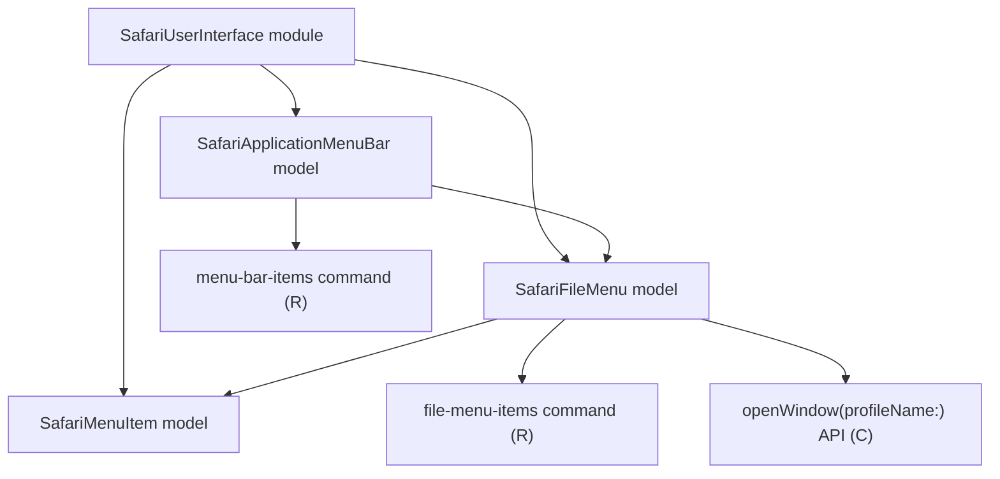

# Safari User Interface Models

## Overview

- The `SafariUserInterface` module owns Safari GUI scripting and menu-level automation.
- It currently exposes three models: `SafariApplicationMenuBar`, `SafariFileMenu`, and `SafariMenuItem`.
- `SafariApplicationMenuBar` represents Safari's top-level application menu bar.
- `SafariFileMenu` represents the `File` menu inside Safari's application menu bar.
- `SafariMenuItem` represents an individual menu item addressable through GUI scripting.

## CRUD matrix

| Model | Command | CRUD | Description |
| --- | --- | --- | --- |
| `SafariApplicationMenuBar` | `menu-bar-items` | `R` | List top-level Safari menu bar items. |
| `SafariFileMenu` | `file-menu-items` | `R` | List items currently exposed by Safari's `File` menu. |
| `SafariFileMenu` | Internal `openWindow` API | `C` | Open a new Safari window, optionally for a specific profile. |
| `SafariMenuItem` | None yet | N/A | Shared representation of concrete menu items. |

## Model architecture

## Notes

- `SafariUserInterface` is a separate module so GUI scripting does not mix with Safari domain models.
- `SafariWindow` in the `Safari` module depends on `SafariFileMenu` through an explicit module boundary.
- `SafariFileMenu.openWindow(profileName:)` is the current create operation in this module.
- UI automation must remain independent of the macOS and Safari language setting.
- The module identifies Safari's `File` menu by menu bar position instead of by localized title text.
- No update or delete command surface is defined for these UI models yet.

## Current implementation

- `menu-bar-items` returns one line per top-level menu in the form `index|title`.
- `file-menu-items` returns one line per File menu item in the form `index|title|commandCharacter|commandModifiers`.
- `SafariFileMenu.openWindow(profileName:)` uses AppleScript to activate Safari and create a new document when no profile is requested.
- When a profile name is provided, it first reads the File menu structure, finds the item whose title ends with the requested profile name, and then clicks that item by index.
- `SafariMenuItem` currently serves as the shared representation type for concrete menu items and leaves room for later explicit menu-item commands.
