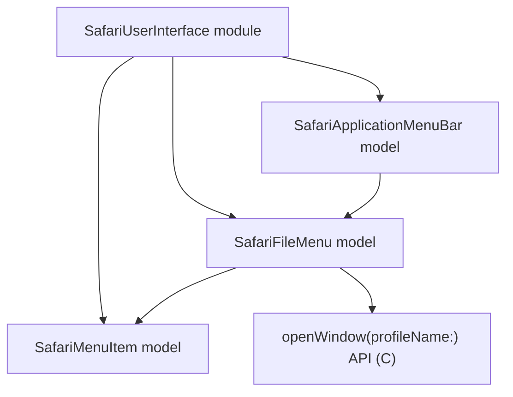

# Safari User Interface Models

## Overview

- The `SafariUserInterface` module owns Safari GUI scripting and menu-level automation.
- It currently exposes three models: `SafariApplicationMenuBar`, `SafariFileMenu`, and `SafariMenuItem`.
- `SafariApplicationMenuBar` represents Safari's top-level application menu bar.
- `SafariFileMenu` represents the `File` menu inside Safari's application menu bar.
- `SafariMenuItem` represents an individual menu item addressable through GUI scripting.

## CRUD matrix

| Model | Command | CRUD | Description |
| --- | --- | --- | --- |
| `SafariApplicationMenuBar` | None yet | N/A | Container model for top-level Safari menus. |
| `SafariFileMenu` | Internal `openWindow` API | `C` | Open a new Safari window, optionally for a specific profile. |
| `SafariMenuItem` | None yet | N/A | Shared representation of concrete menu items. |

## Model architecture

## Notes

- `SafariUserInterface` is a separate module so GUI scripting does not mix with Safari domain models.
- `SafariWindow` in the `Safari` module depends on `SafariFileMenu` through an explicit module boundary.
- `SafariFileMenu.openWindow(profileName:)` is the current create operation in this module.
- No read, update, or delete command surface is defined for these UI models yet.

## Current implementation

- `SafariFileMenu.openWindow(profileName:)` uses AppleScript to activate Safari and create a new document when no profile is requested.
- When a profile name is provided, it uses System Events GUI scripting to inspect Safari's `File` menu and click the matching profile-specific new-window item.
- `SafariMenuItem` currently serves as the shared representation type for concrete menu items and leaves room for later explicit menu-item commands.
