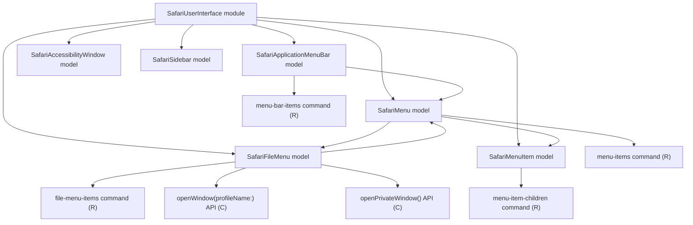

# Safari User Interface Models

## Overview

- The `SafariUserInterface` module owns Safari GUI scripting and menu-level automation.
- Direct AppleScript access is delegated to the separate `SafariAppleScript` module.
- It currently exposes six models: `SafariApplicationMenuBar`, `SafariAccessibilityWindow`, `SafariSidebar`, `SafariMenu`, `SafariFileMenu`, and `SafariMenuItem`.
- `SafariApplicationMenuBar` represents Safari's top-level application menu bar.
- `SafariAccessibilityWindow` captures the focused Safari window for visibility readback and exact close-button fallback.
- `SafariSidebar` represents the opened front-window Safari sidebar as a reusable structural targeting surface.
- `SafariMenu` represents an arbitrary top-level Safari application menu addressed by structure.
- `SafariFileMenu` represents a thin specialization of `SafariMenu` for Safari's `File` menu.
- `SafariMenuItem` represents an individual menu item addressable through GUI scripting.

## CRUD matrix

| Model | Command | CRUD | Description |
| --- | --- | --- | --- |
| `SafariApplicationMenuBar` | `menu-bar-items` | `R` | List top-level Safari menu bar items. |
| `SafariAccessibilityWindow` | Internal `closeFocusedWindow` API | `D` | Verify a focused window disappeared after normal close and press that exact window's close button only when it remains visible. |
| `SafariSidebar` | Internal `selectTabGroup` API | `U` | Select a saved tab-group row by authoritative identifier, using its display name only when the sidebar exposes no stable group identifiers. |
| `SafariSidebar` | Internal `renameTabGroup` API | `U` | Support post-create naming for the newly created tab group. |
| `SafariSidebar` | Internal `deleteSelectedTabGroup` API | `D` | Delete the selected saved tab group through its accessibility menu item. |
| `SafariMenu` | `menu-items` | `R` | List items for a top-level Safari menu chosen by menu bar item index. |
| `SafariFileMenu` | `file-menu-items` | `R` | List items currently exposed by Safari's `File` menu. |
| `SafariFileMenu` | Internal `openWindow` API | `C` | Open a new Safari window, optionally for a specific profile. |
| `SafariFileMenu` | Internal `openPrivateWindow` API | `C` | Open a new Safari private window. |
| `SafariFileMenu` | Internal `createEmptyTabGroup` API | `C` | Trigger Safari's File-menu create action for a new empty tab group. |
| `SafariFileMenu` | Internal `deleteCurrentTabGroup` API | `D` | Trigger Safari's File-menu delete action for the currently selected tab group when that surface is explicitly needed. |
| `SafariMenuItem` | `menu-item-children` | `R` | List the child items of a specific Safari menu item. |

## Model architecture

## Notes

- `SafariUserInterface` is a separate module so GUI scripting does not mix with Safari domain models.
- `SafariUserInterface` depends on `SafariAppleScript` instead of owning AppleScript execution directly.
- `SafariWindow` in the `Safari` module currently depends on `SafariFileMenu` for window creation and `SafariSidebar` for saved tab-group selection through explicit module boundaries.
- Identifier-targeted window closing focuses the stable Safari id, captures that exact focused AX window, verifies it is no longer visible after the normal close request, and presses its structural close button only as a fallback.
- `SafariTabGroup` in the `Safari` module currently depends on `SafariSidebar` for structural targeting, `SafariFileMenu` for the create trigger, and the sidebar context menu for delete.
- `SafariSidebar.selectTabGroup(identifier:named:)` treats parsed `SidebarLibraryItemTabGroup` identifiers as authoritative: an exact identifier selects the row, any exposed nonmatching identifiers prevent name fallback, and name-only selection remains available only when the sidebar exposes no stable group id or the caller has no persisted id yet.
- `SafariMenu` is the primary general-purpose menu model for future UI automation work.
- `SafariFileMenu.openWindow(profileName:)` is the current create operation in this module.
- `SafariFileMenu.openPrivateWindow()` is the explicit create operation for Safari's private-window mode.
- Supported Safari tab-group operations are intentionally split into:
  - sidebar-driven targeting
  - File-menu create only where Safari exposes no equivalent sidebar mutation trigger for new empty groups
- Current verified tab-group flows are:
  - create: File-menu `NewEmptyTabGroupMenuItem`, then inline sidebar text field
  - select/open existing group: identifier-aware sidebar group selection
  - delete: identifier-aware sidebar group selection, then context-menu `DeleteTabGroupMenuItem`
- Safari also shows a visual rename affordance for saved tab groups, but the trigger for that affordance is not currently available through a stable accessibility surface, so no standalone rename command is exposed.
- A create-new-and-delete-old fallback would be a replacement workflow, not a UI rename workflow, because it would create a different saved tab-group identity.
- UI automation must remain independent of the macOS and Safari language setting.
- Shared accessibility helpers centralize typed attribute reads, element arrays, string/boolean conversion, and bounded polling for delayed Safari UI state.
- The module identifies Safari's `File` menu by menu bar position instead of by localized title text.
- `SafariFileMenu` is intentionally a thin specialization rather than the primary abstraction for menu automation.
- `SafariMenuItem` addresses concrete menu items by structural coordinates: `menu-bar-item-index` plus `menu-item-index`.
- No update or delete command surface is defined for these UI models yet.

## Current implementation

- `menu-bar-items` returns one line per top-level menu in the form `index|title`.
- `menu-items <menu-bar-item-index>` returns one line per item in the selected top-level menu in the form `index|title|commandCharacter|commandModifiers`.
- `file-menu-items` returns one line per File menu item in the form `index|title|commandCharacter|commandModifiers`.
- `menu-item-children <menu-bar-item-index> <menu-item-index>` returns one line per child item in the form `index|title|commandCharacter|commandModifiers`.
- `SafariMenu` owns the shared implementation for reading top-level menu items.
- `SafariMenu` waits for menu and sheet accessibility elements through bounded polling instead of fixed sleeps.
- Native menu, File-menu, sidebar, and focused-window operations use an explicit `SafariAccessibilityBackend` dependency that owns application lookup, attribute reads and writes, actions, and polling.
- Production entry points select the live Accessibility backend explicitly. Executor-taking fallback entry points select the AppleScript transport explicitly; backend choice never depends on a concrete executor type check.
- Native application lookup examines the available Safari application elements for the relevant menu bar or focused window instead of unconditionally using the first running Safari process.
- Tests inject synthetic AX element graphs through the same backend boundary, so no unit test launches, focuses, reads, or mutates real Safari.
- `SafariUserInterface` uses `SafariAppleScript` as its explicit fallback script transport and parsing layer.
- `SafariFileMenu.openWindow(profileName:)` uses AppleScript to activate Safari and create a new document when no profile is requested.
- When a profile name is provided, it first reads the File menu structure, finds the item whose title ends with the requested profile name, and then clicks that item by index.
- Profile-specific window opening waits until Safari exposes a visible window before selecting the profile-specific File-menu item.
- `SafariFileMenu.openPrivateWindow()` identifies the native File-menu entry through its stable identifier or shortcut metadata (`N` with modifier value `1`) instead of localized title text.
- `SafariFileMenu.createEmptyTabGroup()` identifies its menu item by the stable accessibility identifier `NewEmptyTabGroupMenuItem` instead of a localized title, verifies that `AXEnabled` is not false, and reports a dedicated disabled-action error without issuing `AXPress` when Safari disables the command.
- `SafariMenuItem` now serves both as the shared representation type and as the model for structured submenu inspection.
- `SafariSidebar.selectTabGroup(identifier:named:)` first attempts direct Swift accessibility selection using the sidebar row/cell accessibility identifier and falls back to the AppleScript transport when direct access cannot complete.
- `SafariSidebar.deleteSelectedTabGroup()` opens the selected group's context menu and invokes `DeleteTabGroupMenuItem`.
- Sidebar reveal, rename, context-menu, and delete-confirmation flows wait for the specific accessibility element or action result they need instead of sleeping for a fixed delay.
- The currently verified uses of the sidebar inline text field are:
  - the post-create flow for a newly created empty tab group
